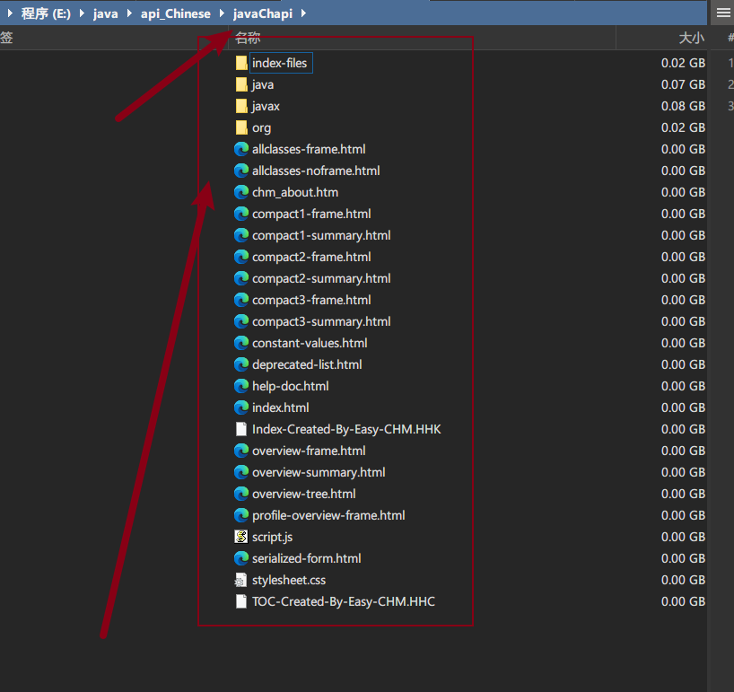
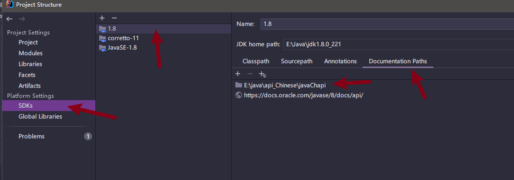
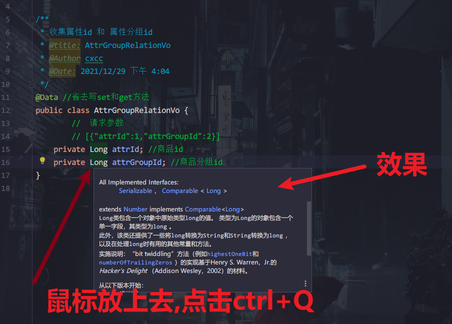
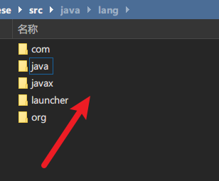
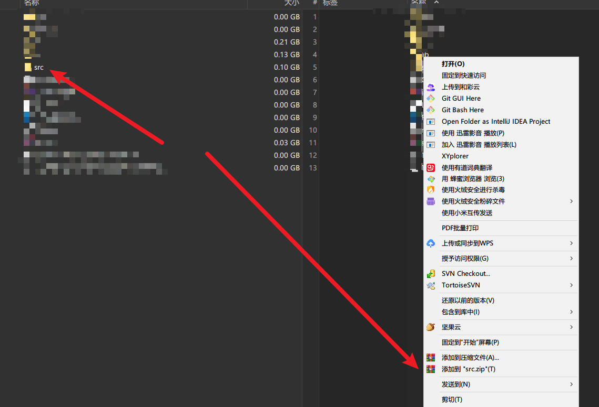
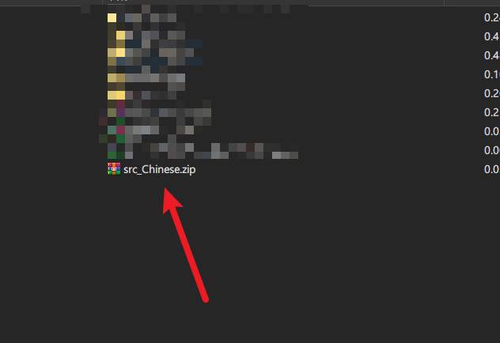
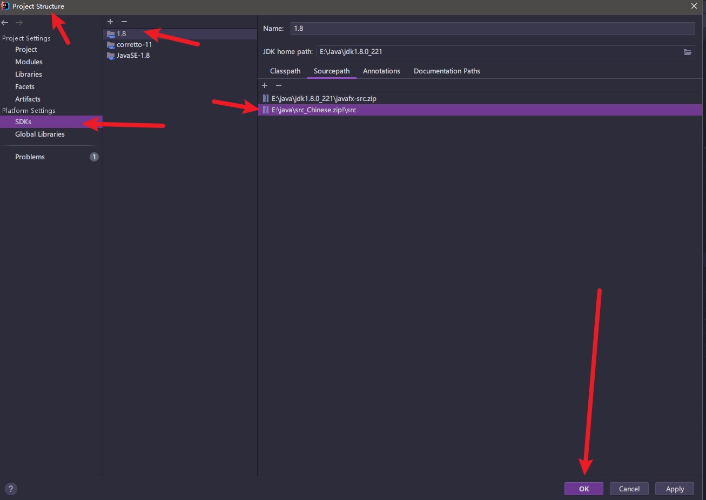
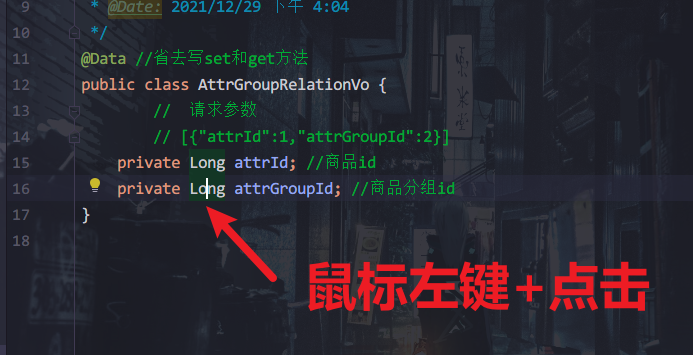
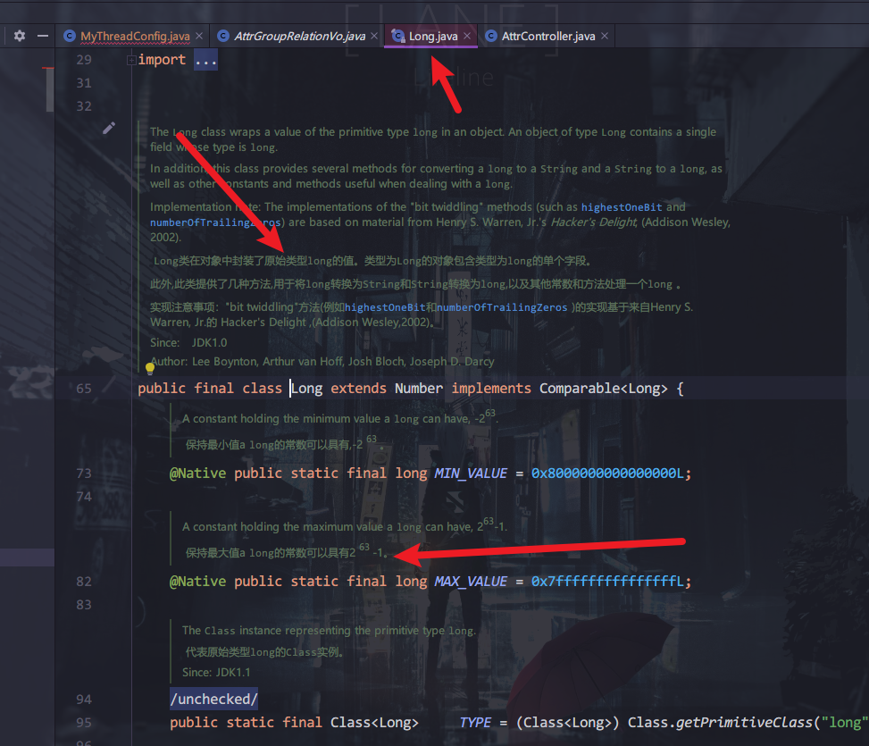
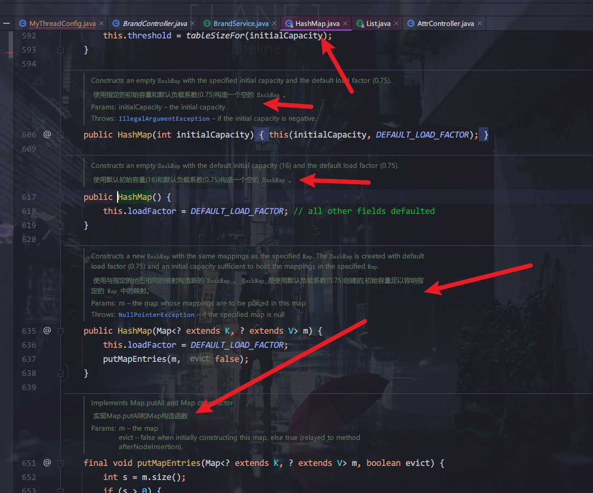

# 一.java_api_文档中文使用教程

### 1.克隆到本地

### 2.在idea中设置

### 3.测试使用

> 点击自己建的文件源码,ctrl+Q就能查看

# 二.jdk1.8_java_src_zip中文源码使用教程

### 1.将这个文件夹文件克隆到本地

### 2.右击整个添加成zip压缩包

#### 得到压缩包

### 3.在idea中设置

### 4.等待扫描完成

### 5.点击方法名,进行测试

